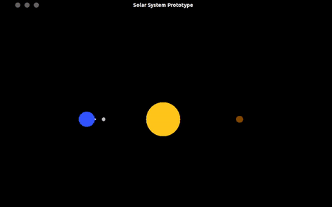

# Solar System Prototype
This is a <i><b>solar system prototype made with OpenGL 3.3, GLUT and C++</b></i>

The purpose of this project is to develop a program capable of representing a planet rotation movements. To do so, it were created a main celestial body where the other bodies will rotate around (aka The Sun), an inner and outer planet. In addition, the blue planet (outer) has two moons orbiting in different axis.

By pressing <i>Y</i> in your keyboard, you can see them rotating.

## Preview
<p align="center">
  
</p>

## Compile and execute
```
g++ main.cpp -o solar -lGL -lGLU -lglut
```

```
./solar
```
